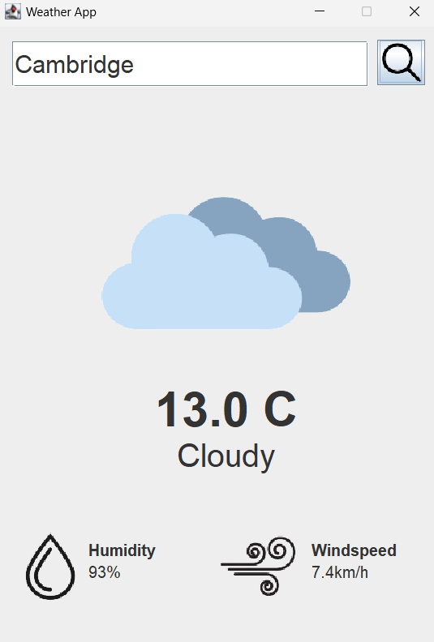

## WEATHER APP GUI

> The Weather App is a software program developed in Java, designed to offer users up-to-date weather details for a chosen area. It retrieves weather data from an external source and presents it through a user-friendly graphical interface. Users simply input their desired location, and the application fetches and displays information such as temperature, current weather conditions, humidity levels, and wind speed.
>
 

